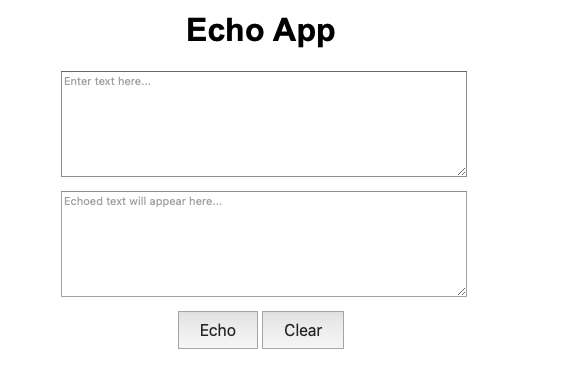
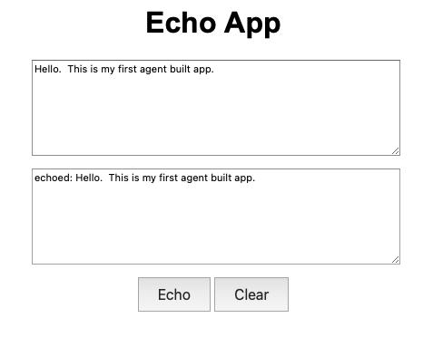

# vsc_agent Project

## Overview
Testbed for Visual Studio Code (VSCode) agent. This project is designed to facilitate the development and testing of an agent that can interact with VSCode.

Inspired by this video: [VS Code Agent Mode Just Changed Everything](https://youtu.be/dutyOc_cAEU)

## Installation
To install the necessary dependencies, run the following command:

```
python -m venv venv
source venv/bin/activate  
pip install -r requirements.txt
```


## Building the application
To build the application, run the following command:

* Start Githug Copilot in Agent mode.

* Reference the [Product Requirements Document (PRD)](./product_requirements_document.md) for the specific build command.

* Enter this prompt: `build the application described in the attachment`

## Testing the application

Start browser and navigate to the URL: `http://127.0.0.1:5000/`

Initial page will show



Enter text and click the `Echo` button.



```